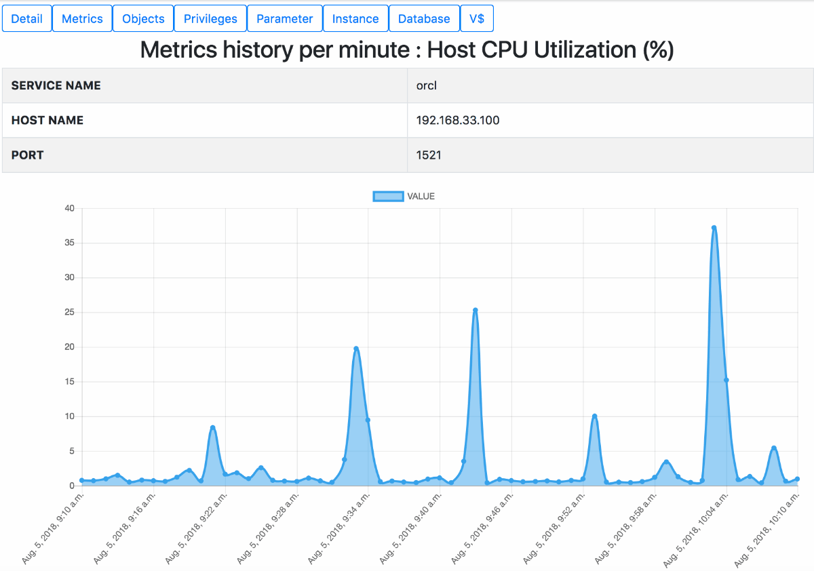

# DBROOT Oracle

DBROOT Oracle is simple web user interface for Oracle.

***DEMO:***

## Features

- Metrics
- Objects
- Privileges
- Dynamic performance views

## Requirement

- Python 3.6
- Django 2.0
- cx_Oracle 6.3
- MySQL 5.7

## Installation

### Step1. Create user and add grant on mysql.
    $ create user 'dbrootuser'@"{from_domain}" identified by "{password}";

### Step2. Edit settings file for mysql connection.
    $ vi project/settings.py

### Step3. Create user and add grant on oracle.
    $ create user dbrootuser identified by {password};
    $ grant connect to dbrootuser;
    $ grant select on dba_tab_privs to dbrootuser;
    $ grant select any table to dbrootuser;
    $ grant select any dictionary to dbrootuser;

### Step4. Edit consts file for oracle connection.
    $ vi app/consts.py

### Step5. Deployment
    $ git clone https://github.com/dbroot-oracle.git
    $ cd dbroot-oracle
    $ pip install -r requirements.txt
    $ python manage.py migrate
    $ python manage.py createsuperuser
    $ python manage.py runserver 8000

## Author

[kiyomomo](https://github.com/kiyomomo)

## License

This software is released under the MIT License.
See [LICENSE](LICENSE) for more details.
